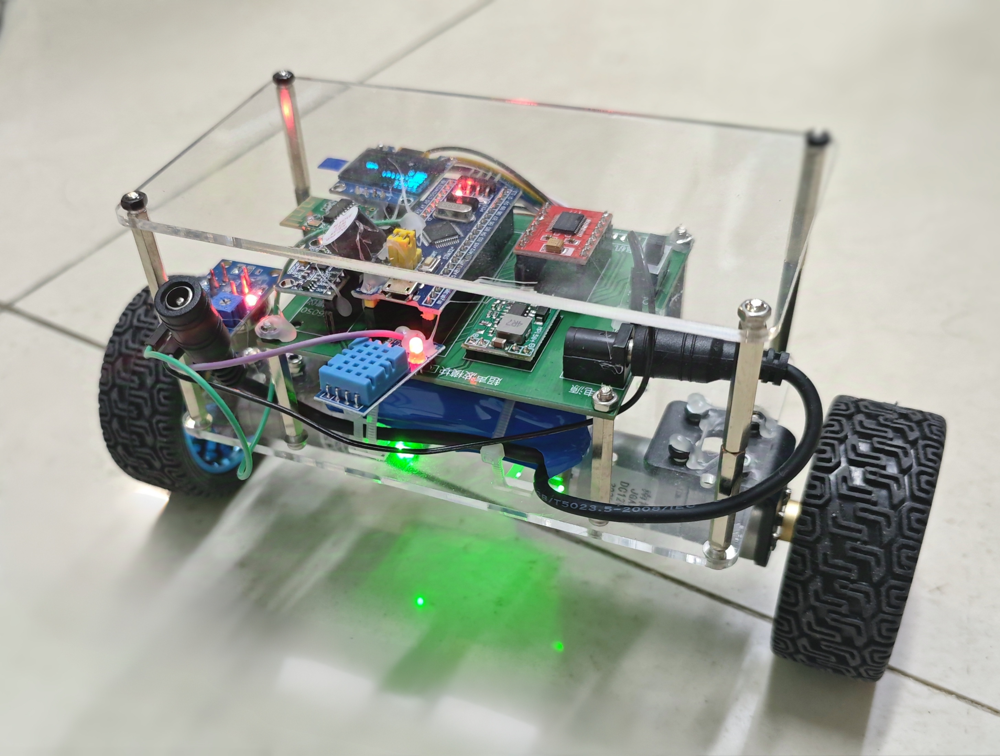
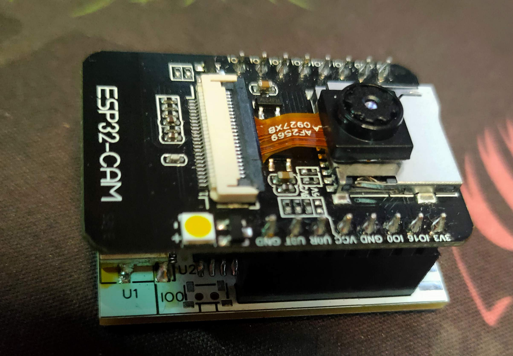
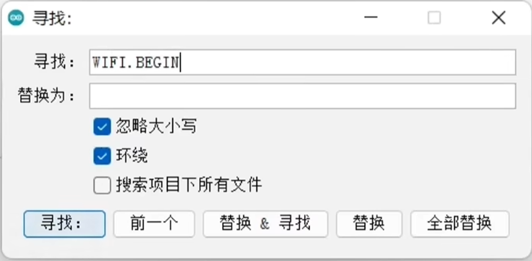
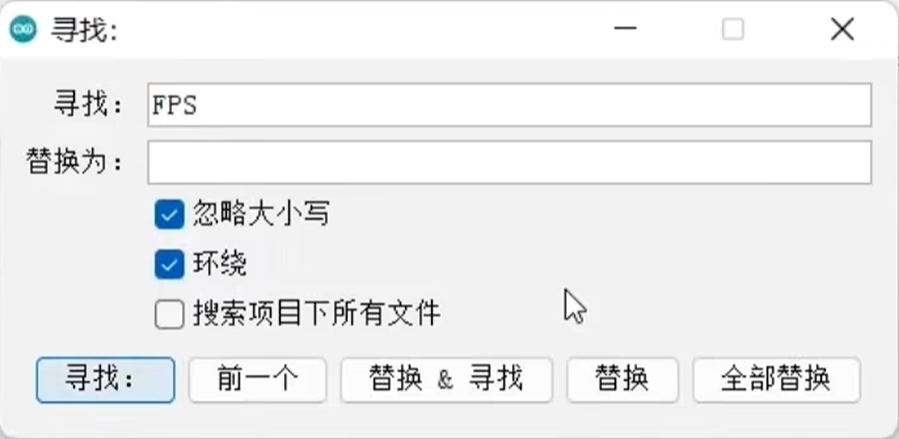
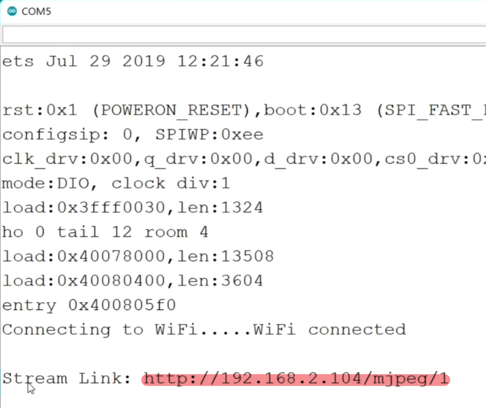

<!-- PROJECT LOGO -->

 
    <h1 align="center">:star: Robot Balance Car 平衡小车</h1>  
    一款基于 STM32 与 PID 控制的双轮平衡车，集成空气检测、火焰报警与实时视频图传功能。         <a href="#-简介"><strong>了解更多 »</strong></a>              <a href="https://github.com/Walessong/Robot_balance_car/issues">报告 Bug</a>    ·    <a href="https://github.com/Walessong/Robot_balance_car/pulls">提出功能需求</a>  

<!-- BADGES -->

        

* * *

## 📋 目录

* [简介](#-简介)
* [功能特性](#-功能特性)
* [项目结构](#-项目结构)
* [硬件清单](#-硬件清单)
* [环境配置](#-环境配置)
* [安装与使用](#-安装与使用)
  * [1. 焊接与组装](#1-焊接与组装)
  * [2. 代码烧录](#2-代码烧录)
  * [3. PID 调参](#3-pid-调参)
  * [4. APP 配置](#4-app-配置)
  * [5. 图传系统](#5-图传系统)
* [模块详解](#-模块详解)
* [示例效果](#-示例效果)
* [贡献方式](#-贡献方式)
* [许可证](#-许可证)
* [致谢](#-致谢)

* * *

## 🎯 简介

> **项目背景：** 参赛于北航 2025 第四届电子信息智能硬件创新大赛，目标是在狭小环境中实现空气质量检测与火灾隐患巡检。

* **主控板：** STM32F103C8T6
* **控制方式：** 双轮自平衡 + PID 算法
* **通信方式：** 手机蓝牙遥控 / ESP32-CAM Wi-Fi 图传
* **传感器：** 温湿度、烟雾浓度、火焰检测
* **显示：** OLED 实时数据显示与报警提示

* * *

## ✨ 功能特性

* 🔧 **两轮自平衡**：基于 MPU6050 六轴传感器实现姿态解算与控制。
* 📱 **蓝牙遥控**：JDY31 蓝牙串口模块，支持方向与速度控制。
* 📡 **Wi-Fi 图传**：ESP32-CAM 实时 MJPEG 视频流。
* 🌡️ **环境监测**：DHT22 温湿度 & MQ-2 烟雾传感。
* 🔥 **火焰报警**：遇火即刻蜂鸣器警报。
* 🖥️ **OLED 显示**：参数实时更新、阈值可调。
* ⚙️ **可视化阈值设置**：按键调节报警灵敏度。

* * *

## 🗂 项目结构

📦 Robot_balance_car

├─ esp32_camera_mjpeg_multiclient/ # ESP32 CAM 和 WiFi图传 代码

├─ img/ # 项目图片

├─ 模块/ # 各硬件模块介绍

├─ 物料清单/ # 详细物料清单

├─ APP配置/ # Arduino 手机蓝牙调试 App 配置文档

├─ LICENSE

├─ PCB_标准版_2025-04-28.pdf

├─ PDF版原理图.pdf

├─ ProPrj_Robot_balance_car.epro # 嘉立创工程文件

├─ README # 本文件

├─ code.zip/ # Keil + STM32CubeMX 工程文件

├─ 元器件.zip # 各元器件详细操作手册和示例代码

└─ 效果图.jpg

* * *

## 📦 硬件清单

## Sheet1

| 类别  | 物料名称 | 数量  | 链接(无广，仅供参考) | 预算(供参考) | 备注  |
| --- | --- | --- | --- | --- | --- |
| 主要部分 | STM32F103C8T6最小系统板 | 1.0 | https://detail.tmall.com/item.htm?abbucket=20&id=738272568606&ns=1&skuId=5098758809471&spm=a21n57.1.0.0.747e523cISKTCt | 14.00 | 排针向下焊 |
| NaN | TB6612电机驱动板模块 | 1.0 | https://e.tb.cn/h.6OptrL1N2qDd9Ms?tk=OD4EVV95Bn7 | 3.00 | 钽电容耐压值35V的红色模块 |
| NaN | 主控PCB | 1.0 | 嘉立创打样 | 20.00 | 每月可免费打样两次 |
| NaN | 亚克力板 | 2.0 | https://e.tb.cn/h.6OkQ7s1mdHUG1bD?tk=1dmBVVOlFG7 | 20.00 | 底座和顶部 |
| NaN | 20pin排母 | 6.0 | https://detail.tmall.com/item.htm?ali\_refid=a3\_430582\_1006:1109983619:N:IBuL1rXf2wNMlW9kfgl/OQ==:55ec7b9d1f5a49b5db66793bfd34dc5b&ali\_trackid=1\_55ec7b9d1f5a49b5db66793bfd34dc5b&id=41234671442&spm=a21n57.1.0.0&skuId=3129099470945 | 2.92 | NaN |
| NaN | 排针20pin | 10.0 | https://detail.tmall.com/item.htm?ali\_refid=a3\_430582\_1006:1109983619:N:YhZ9BCTMjCVmm%20rIrbS2bg==:2978dade035baf776648433cdb0597d6&ali\_trackid=1\_2978dade035baf776648433cdb0597d6&id=609362740741&spm=a21n57.1.0.0&skuId=4282842644109 | 3.12 | NaN |
| NaN | MPU6050陀螺仪模块 | 1.0 | https://detail.tmall.com/item.htm?spm=a1z10.3-b-s.w4011-16538328900.25.50983d6cVfKaz9&id=41337720621&rn=994cbaadf8aef2bc68c38fa273dfcd9a&abbucket=6&skuId=4188052896336 | 12.54 | 可能有质量问题导致初始化失败，及时更换 |
| NaN | DC005电源插座 | 1.0 | https://e.tb.cn/h.6OpKssmhDoEnv4m?tk=64UUVV93fJm | 0.03 | NaN |
| NaN | JDY68A(蓝牙模块) | 1.0 | https://e.tb.cn/h.6OpeX0rKEpwtWwk?tk=n7hLVVQJGF9 | 13.00 | NaN |
| NaN | HC-SR04(超声波模块) | 1.0 | https://detail.tmall.com/item.htm?spm=a230r.1.14.9.66887fb5zIpYKx&id=41248598447&ns=1&abbucket=20 | 5.87 | NaN |
| NaN | JGA25-370直流减速电机(带编码器带轮子及连接件)(6v 280转) | 2.0 | https://e.tb.cn/h.6OiVvgkcMpQwsnq?tk=RzYEVVj56dA | 60.00 | 两只(这个电机最便宜，而且带轮子，但性能不太好，但是能用)，预算充足可以看看轮趣家的，370电机 |
| NaN | 0.96寸OLED | 1.0 | https://item.taobao.com/item.htm?spm=a230r.1.14.3.566c2805SB81IJ&id=43639171586&ns=1&abbucket=20#detail | 10.80 | 新版本 gnd开头，颜色任选 |
| NaN | MP1584EN DC-DC直流降压模块 | 1.0 | https://e.tb.cn/h.6O8SyikzdnoHLE9?tk=ToEqVV9Rhkh | 4.20 | 可以多买一个备用 |
| NaN | m3铜柱（40mm) | 8.0 | https://detail.tmall.com/item.htm?abbucket=20&id=534856751282&ns=1&spm=a21n57.1.0.0.d90e523cXsUguI&skuId=5095132382312 | 5.40 | 双通  |
| NaN | m3\*10螺丝 | 8.0 | https://detail.tmall.com/item.htm?abbucket=20&id=694131607161&ns=1&spm=a21n57.1.0.0.d90e523cXsUguI | 2.26 | m3\*8，m3\*12也可以买些 |
| NaN | m3螺母防松 | 8.0 | https://detail.tmall.com/item.htm?abbucket=20&id=534828257082&ns=1&spm=a21n57.1.0.0.5c64523cS28gu0&skuId=3192161696945 | 3.40 | NaN |
| NaN | 18650锂电池组 | 1.0 | https://e.tb.cn/h.6ONXdoj8g6g8hLe?tk=hExdVV9L8H3 | 27.00 | 12V，带充电器 |
| NaN | 18650锂电池组 | 1.0 | https://e.tb.cn/h.6OoxQYnJEV7TN3j?tk=WyscVVO83L3 | 20.00 | 5V，输出micro公头 |
| NaN | 扎带  | 10.0 | https://e.tb.cn/h.6OpwcpZLEf0PEap?tk=OWP6VVQuHxn | 2.00 | 可拆卸版本更方便 |
| 拓展模块 | TMB12A05蜂鸣器 | 1.0 | https://e.tb.cn/h.6O798vQjcgzByTW?tk=eBr5VV8OjcK | 0.35 | NaN |
| NaN | MQ-2烟雾气敏传感器模块 | 1.0 | https://e.tb.cn/h.6OlXEeJOkkL4i9Q?tk=fc6pVV8Nh55 | 6.00 | 不要只买探头 |
| NaN | DHT11温湿度传感器模块 | 1.0 | https://e.tb.cn/h.6Ood4WCMUpJrj70?tk=Ex6uVV8oubg | 6.00 | NaN |
| NaN | ESP32CAM | 1.0 | https://e.tb.cn/h.6OI0rxnCNr6FXNM?tk=5jPlVVOLhAF | 45.00 | 带烧录座 |
| NaN | SG90 9g舵机 | 2.0 | https://e.tb.cn/h.6OlLFQ6L39h1WCq?tk=yDIxVVj2ZEo | 6.00 | 90-180通用 |
| 小计  | NaN | NaN | NaN | 292.89 | NaN |
| 工具类 | 电烙铁 | 1.0 | NaN | 30.00 | NaN |
| NaN | 焊锡丝 | 1.0 | NaN | 10.00 | NaN |
| NaN | 热熔胶枪 | 1.0 | NaN | 12.00 | 小功率的即可 |
| NaN | 杜邦线 | 6.0 | NaN | 15.00 | 10cm、15cm、公对公、母对母、公对母 |
| NaN | 小十字螺丝刀 | 1.0 | NaN | 2.00 | NaN |
| NaN | 内六角螺丝刀 | 1.0 | NaN | 30.00 | 一套  |
| NaN | jlink或者stlink | 1.0 | NaN | 10.00 | 下载器，烧录程序用 |

详细 Excel 清单见 `物料清单/` 文件夹。

* * *

## 🛠 环境配置

### Windows

1. **Arduino IDE**
  * 使用教程（B 站）：[Arduino IDE 安装与配置](https://www.bilibili.com/video/BV1tWZqYNEwP)
2. **Keil uVision5**
  * 使用教程（B 站）：[Keil 安装与项目搭建](https://www.bilibili.com/video/BV1th411z7sn?p=3)
3. **嘉立创 EDA**
  * 推荐专业版，PCB 设计与焊接参考。

### 手机端

* **蓝牙调试器** App
* 浏览器访问 ESP32-CAM 视频流

* * *

## 🚀 安装与使用

### 1️⃣ 焊接与组装

此处补充笔者初学焊接的经验：

📝 焊接排针的实用技巧

* 🚷 **安全健康:** 焊接产生的烟雾可能会导致头晕等，尽可能在通风良好的环境焊接。有条件的话，使用排风设备。
  
* 🔍 **工具:** 
  
  * 推荐使用恒温烙铁，保持稳定的工作温度，避免虚焊或损坏电路元件。
    
  * 焊接细小元件，可用焊锡膏＋热风枪。
    
* 🔥 **焊接技巧:** 
  
  * 焊接排针时，固定好一个焊点后再焊接其他焊点，避免排针的移动。
    
  * 焊接电线，可以先往电线上加一点锡（不能太多）
    
  * 焊接表面过于光滑，可以弄一点划痕
    
* 🧼 使用湿海绵清洁烙铁头，不然烙铁头上的残渣反复被加热会氧化，影响吸附。
  
* 🕒 **焊接时间:** 每个焊点需要加热约两秒钟，焊锡充分熔化，与焊接部件良好结合，防止虚焊。
  
* 🛠️ **元件的方向:** 焊接时必须特别注意模块的方向，错误接入很可能导致电路损坏，尤其是电源模块，以及编码器电机的编码器，一定一定要看好接线图。
  
* 🚦 **检测焊接质量:** 用万用表测试电路的导通性和电压输出，避免因接错焊点而导致电路异常。
  

平衡小车的机械结构大同小异，B站有不少组装教程。

e.g.[4.小车拼装教程_哔哩哔哩_bilibili](https://www.bilibili.com/video/BV1Gc411v73h?spm_id_from=333.788.videopod.episodes&vd_source=418d43b5808f02eef3f6ab61b59ae8fe&p=4)

注意外露的电线不要触碰在一起，以及有的排针排母、模块等连接不牢固可以用热熔胶枪固定一下。

### 2️⃣ 代码烧录

1. 使用 ST-LINK 或下载线连接开发板。
2. 打开 `code\USER\UpStanding_Car.uvprojx`，在 Keil 中编译并下载。

### 3️⃣ PID 调参

* OLED 显示 PID 实时信息。
  
* 通过按键微调 `Kp`、`Ki`、`Kd`，观察平衡效果。
  

### 4️⃣ App 配置

* 打开 `APP配置.docx`，根据文档在手机上安装并设置串口参数。

### 5️⃣ 图传系统

ESP32是ESP8266的升级版，主要特点包括由单核升级为双核，主频从80MHz提升至240MHz，并新增了蓝牙模块和TF卡扩展支持。这些改进使得ESP32在性能和可玩性上有了质的提升。建议购买硬件时，将烧录器一并购买，以简化后续程序上传的过程。

将下载整理的代码进行必要的修改后，即可上传。具体操作是打开文件夹中的`esp32_camera_mjpeg_multiclient`，启动Arduino IDE，修改WiFi连接信息，即搜索`wifi.begin`，在此处设置WiFi名称与密码，还可根据需求设置刷新帧率（FPS），可将其调整为适合实际需求的值。

代码修改完成后，点击上传按钮，等待编译完成。在上传完成后，点击右上角的串口监视器，同时按下开发板的复位键。开发板将尝试连接WiFi，当连接成功后会输出一个HTTP地址，该地址为视频流链接。

查看串口监视器获取的 HTTP 地址，在浏览器中打开，即可查看ESP32 Camera的实时画面。

---

### :six: 舵机控制模块

舵机控制系统由Arduino主控、蓝牙通信模块、舵机执行单元和电源管理模块组成。蓝牙模块接收手机端单字符指令，Arduino通过步进逻辑控制舵机角度，电源模块独立供电保障稳定性。

本项目采用HC-05蓝牙模块和SG90舵机，实现**增量式控制**策略。通过手机APP按钮发送ASCII字符指令，代码解析后执行5°步进调节，具备实时角度反馈功能。

#### 💡经验以及相关介绍

1.**组成部分**

* **控制核心**：Arduino Uno作为处理中枢，解析蓝牙指令并生成PWM信号
* **通信单元**：HC-05模块实现手机-硬件双向通信（默认波特率9600）
* **执行机构**：2个SG90舵机构成二自由度机械结构
* **供电系统**：二路电源模块（5V/3A输出）独立驱动舵机，与主控电源隔离

2.**舵机安装**：我们采用的是2个SG90舵机,b站有许多组装教程可以参考。

e.g [二自由舵机云台安装教程__ 哔哩哔哩___ bilibili](https://www.bilibili.com/video/BV1aaStY8E3G/?spm_id_from=333.337.search-card.all.click&vd_source=1fc467ff4cce04080fa8abd171a0a492)

3.💡**模块协同逻辑**（匹配代码文件）

* **指令交互协议**
  
  | 指令字符 | 控制动作 | 代码对应逻辑 |
  | --- | --- | --- |
  | `U` | 舵机1角度+5° | `angle1 = min(angle1+5, 180)` |
  | `D` | 舵机1角度-5° | `angle1 = max(angle1-5, 0)` |
  | `R` | 舵机2角度+5° | `angle2 = min(angle2+5, 180)` |
  | `L` | 舵机2角度-5° | `angle2 = max(angle2-5, 0)` |
  | `C` | 双舵机复位至90°中位 | `angle1=angle2=90` |
  
* **数据流设计**
  
      手机APP按钮 → 发送单字符指令 → HC-05透传 → Arduino硬件串口
      → Serial.read()捕获字符 → switch-case逻辑处理 → 更新角度变量
      → servo.write()输出PWM → 实时反馈当前角度至手机端
  
* **关键代码实现**
  
  * **指令捕获**：`char command = Serial.read()`直接获取单字节指令
  * **步进控制**：采用`min()/max()`函数实现软限位（0-180°范围保护）
  * **状态反馈**：每次动作后发送`A[角度1]B[角度2]`格式数据（与初始方案兼容）
* **硬件交互特性**
  
  * **PWM精度**：SG90舵机脉宽分辨率为1μs（约0.09°/μs）
  * **响应延迟**：单次指令处理周期<10ms（包含蓝牙传输时延）
  * **共地要求**：舵机GND必须与Arduino GND直连 ：

4.**调试与优化**

* **电源诊断**：舵机抖动时测量工作电压（正常≥4.8V），压降过大需升级线材
* **通信测试**：使用串口监视器观察原始数据，排查TX/RX反接问题
* **机械保护**：3D打印限位结构防止180°极限位置堵转
* **功耗管理**：待机时切换舵机为扭矩保持模式降低能耗

5.**典型问题解决方案**

| 故障现象 | 排查步骤 | 解决方法 |
| --- | --- | --- |
| 单舵机无响应 | 1. 检测PWM引脚接触 2. 测量信号线电压 | 更换杜邦线或重焊接口 |
| 蓝牙频繁断开 | 1. 检查天线朝向 2. 测量模块供电电压 | 外接470μF电容稳压 改用5V供电 |
| 角度定位漂移 | 1. 检查舵机齿轮间隙 2. 测试空载精度 | 增加电位器校准程序 更换金属齿轮舵机 |

* * *

## 🔧 模块详解

### 1.OLED

初学者可先学习如何在OLED模块上显示数字、字符串和汉字等内容。OLED模块与传统LCD显示器的主要区别是OLED没有背光，OLED技术的最大优势也在于能够做到完全黑色显示，这是由于其每个像素能独立控制，不需要背光，产生更高的对比度和更深的色彩。相比之下，LCD即使在显示黑色时，背光仍会影响色彩表现。使用I2C通信协议进行设备间的数据传输，底层寄存器操作复杂，推荐使用封装好的驱动代码来提高编写速度。项目中提供了实际操作代码和步骤，供参考和执行。

⚠️ **软件设置的注意事项**：在设置驱动和开发环境时，确保常见引脚设置的正确性（如PA13和PA14用于下载），避免因引脚配置错误而引发的调试问题。

* * *

### 2.MPU6050

MPU6050是一个六轴传感器，能够同时读取三轴加速度和角速度数据。内置有数字运动处理（DMP）模块，可以进行自态解算，得到欧拉角，包括横滚角、俯仰角和偏航角。

在该项目中，我们将实现如何通过STM32与该模块进行通信，将获取的角度数据通过OLED屏幕进行显示，学会有关电路连接、工程文件管理、编写驱动代码，以及使用CubeMX配置I2C接口，最终在OLED上成功显示实时角度值的变化。

#### 📖简要步骤：

1.电路图与硬件连接

电路图显示该模块具有八个引脚，其中主要使用四个引脚。包括电源引脚、D引脚及I2C的两个接口。

2.软件开发环境设置

在打开CubeMX后，选择PB3和PB4作为I2C接口，但有必要说明其是软件模拟I2C，而不是硬件I2C。

3.添加MPU6050库函数

在工程目录中添加MPU6050的驱动代码，包括头文件和C文件。

4.编写主程序

主程序的编写包括初始化MPU6050模块和I2C接口。在初始化成功后，显示信息指示成功与否。同时定义三个角度参数并调用DMP读取函数，每隔十毫秒读取一次数据。为了方便输出，插入了标准输入输出相关代码。

5.显示数据

在OLED显示上需要将读取到的角度值转化为字符串，通过格式化函数使得显示内容保持两位小数。在显示时添加适当的空格，以避免数据重叠或显示不清晰。

6.测试效果

经过编译和下载程序后，按下复位键，成功地在屏幕上看到了动态变化的角度参数。其中翻滚角和俯仰角发生的变化较为明显，偏航角的值也保持稳定，这表明MPU6050与STM32之间的通信和数据处理已成功实现。

* * *

### 3.电机驱动模块

电机驱动主要由STM32单片机、驱动模块和输出电机三个部分构成。驱动模块的作用是将3.3V的单片机信号转换为12V的电机驱动信号。

本项目使用了TB662模块，初学者可了解驱动模块故障的排查方法、PWM信号的应用、电机转向和转速控制的原理、H桥驱动方式。此外，视频还演示了如何通过程序进行电机的速度和方向控制，以及相应的代码实现步骤。

#### 💡经验

1. 组成部分

电机驱动系统主要由三个部分组成：STM32单片机、驱动模块和输出电机。STM32作为控制单元，负责生成控制信号；驱动模块负责将较低电压（3.3V）的控制信号转换为能够驱动电机的高电压（12V）信号；而电机则是最终执行机构。

2. 驱动模块功能

驱动模块的关键功能是电压转换。如果电机只有单向转动或只有一个电机运转，问题通常出在驱动模块。故障排查首先需要检查焊接和连接是否良好。此外，驱动模块一般较为耐用，但在电机堵转或过载时可能产生高电流，从而导致发热，严重时可能损坏电机。TB662驱动模块含有高温保护功能，当温度过高时会自动断电防止损坏。

3. 模块选择及差异

在模块选择上，常见的有红色和黑色板，主要区别在于电容的耐压值。电容的耐压需要比实际工作电压高出1.5倍。例如，16V的耐压值允许的工作电压约为10.6V，对于设计工作电压为10V的模块非常合适。对于黑色模块，其耐压可达到35V，适于更高电压应用。

4. 驱动模块引脚及原理

驱动模块的引脚设有两个组，通常一个组负责控制电机转速`（PWM）`，另一个组则控制转向`（IN1、IN2）`。使用PWM信号可以调节电机的转速，通过改变高电平的占空比实现。

5. 控制原理

电机驱动具有“半桥驱动”设计，左右两组MOS管交替工作，控制电流方向，从而实现转动。所有MOS管按组排列，按相应信号导通，导致电机顺或逆转。

6. 编程实现

在编写程序时，首先要在开发环境中定义输入信号、设置PWM、调整频率和占空比等。定时器的配置会影响PWM的输出频率，通过计算确定预分频值和自动重载寄存器值。通过`Duty`值的调整实现电机的控制，负值表示反转，正值表示正转。

7. 实现与测试

编写完程序后，进行编译并下载至单片机。观察电机转动时的表现，注意测速和正反转。为了使小车能够前进或后退，两个电机需分别设置为不同的转向，此逻辑便于编程实现。

* * *

### 4.编码器测速

#### 电机测速及编码器使用解析

1.霍尔编码器结构

霍尔编码器由磁环和两个对称分布的霍尔传感器组成。霍尔传感器基于霍尔效应工作——当传感器检测到正极的磁场时，输出高电平；检测到负极时，则输出低电平。通过设置磁环上的正负极交替分布，可以产生周期性的脉冲波，这些脉冲波的频率与电机转速成正比。

2.测速原理

测速的核心在于计算霍尔编码器产生的脉冲频率。初学者可以520电机为例，了解其减速比及脉冲输出的计算方法。若电机的减速比为1:30，每当轮胎大轴转动一圈，小轴的磁环则转动30圈。因此计算大轮胎转动一圈时的输出脉冲为330个（11个脉冲乘以30）。

3.编码器波形演示

可通过逻辑分析仪观察霍尔编码器的输出波形。未转动时，输出为高电平，来回旋转电机后则可以观察到矩形波，具体的占空比和其特性将用示波器进行分析。

4.硬件与软件协同

电机控制采用STM32中定时器的编码器模式，具体设置可以让电机的顺逆时针旋转被有效识别。通过对信号频率的判断，程序将能够准确计算电机的转速。

5.代码实现细节

项目代码可重点阅读如何读取编码器的值——定义相应的函数和变量，确保能定时（例如每10毫秒）读取编码器的状态。严谨管理负数和正数的处理也确保了计数的有效性。

* * *

### 5.蓝牙串口通信

在本项目中，我们使用JDY31串口模块在单片机与手机之间进行串口通信。用户可以通过手机发送遥控指令，控制平衡小车的运动，同时接收单片机实时发送的数据如速度、角度和距离等。

#### ⚙️有关介绍

1.模块概述用于实现单片机与手机之间的串口通信的设备。通过该模块，用户可以通过手机发送控制指令来遥控设备（如平衡小车），实现诸如左转、右转、直行和后退等动作。同时，单片机也可以实时发送相关数据，如速度值、角度值和距离值，以便用户进行查看。

2.模块兼容性有多个版本，包括6帧和4帧模式，均兼容性良好。只需连接中间的四根脚即可。此外，市面上还有其他类型的蓝牙模块，例如HC05等，虽然功能上类似，但在价格和主从机的支持上有所不同。JDY68A为从机，只能被其他设备配对，而HC05具备主从一体的功能，能够作为主机和从机使用。

3.蓝牙配对使用模块时，单片机与手机之间的配对过程是关键。手机作为主机发出配对请求，模块接受请求。需要注意的是，JDY68A模块无法主动发起配对。

4.程序设计编程时，需要在CubeMX环境中进行电路图配置，重要的是TX和RX的正确连接，确保串口通信的正常进行。其中单片机TX引脚连接到蓝牙模块的RX引脚，RX引脚连接到TX引脚，实现数据反向传输。此外，在设置中需配置UART设置，包括波特率、数据位和停止位，以确保双方通信参数一致。

5.数据发送与接收在程序中，使用uartTransmit函数进行数据发送。可调用的示例包括发送"hello world"字符串，随后通过手机APP进行连接和调试。在接收数据时，需要定义接收缓冲变量，并在中断服务程序中实现接收操作。每当接收到一个字符，便进入中断并将其存储到指定的缓冲区中。

6.遥控功能实现接收后数据经过处理，可实现对小车的遥控指令识别，例如：0x01表示前进，0x02表示右转等。通过简单的switch语句可以将接收到的控制数据解码，并执行相应的动作。这套机制使手机能有效控制单片机的多个功能，增强了操作的便利性。

* * *

## 🎬 示例效果

  

* * *

## 🤝 贡献方式

1. Fork 本仓库
2. 新建分支 (`git checkout -b feature/YourFeature`)
3. 提交修改 (`git commit -m 'Add some feature'`)
4. 推送分支 (`git push origin feature/YourFeature`)
5. 提交 PR

请在 PR 中说明新增功能与测试步骤。

* * *

## 📄 许可证

MIT License © 2025 [Your Name] - 详情见 [LICENSE](LICENSE)

* * *

## 🙏 致谢

* 北航 电子科技协会 社团
* 北航 2025 第四届电子信息智能硬件创新大赛 组织方
* 提供示例与驱动的优秀开源项目
