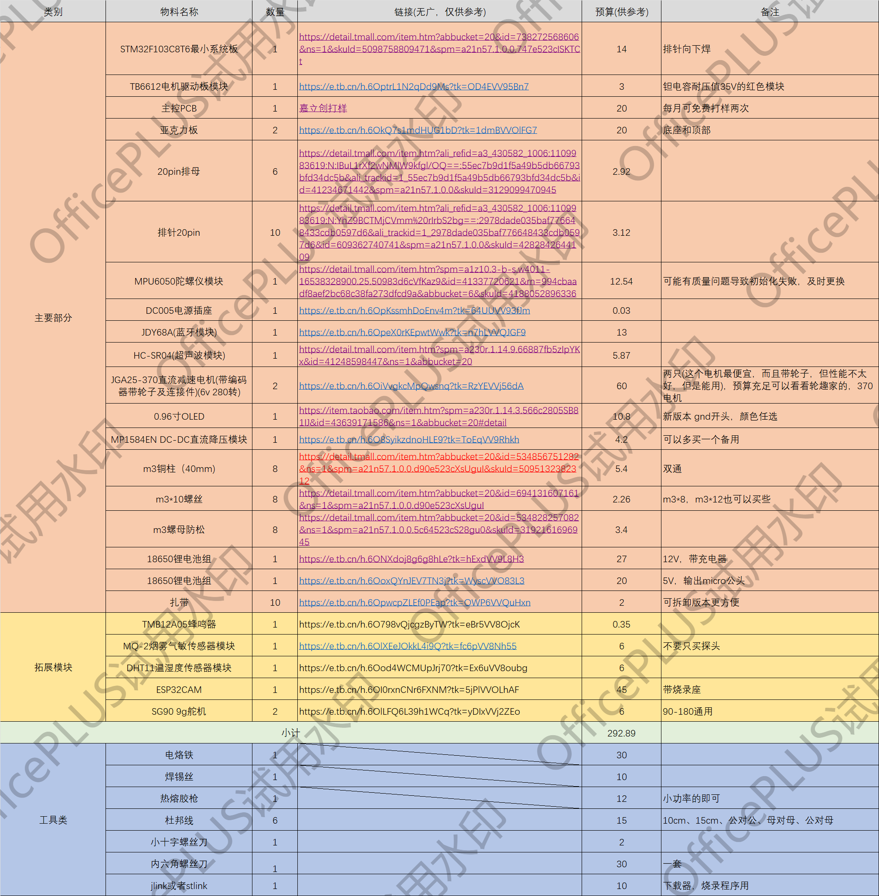
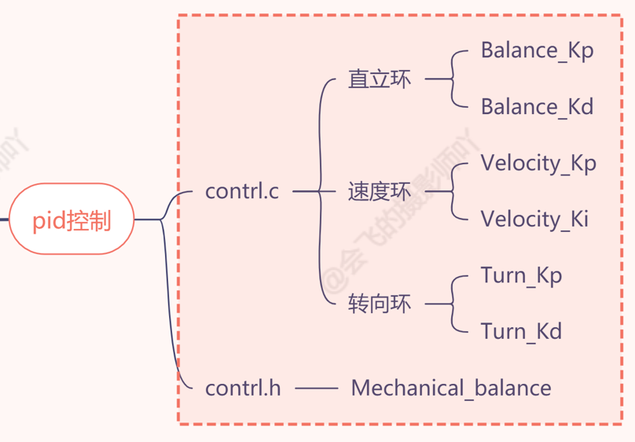
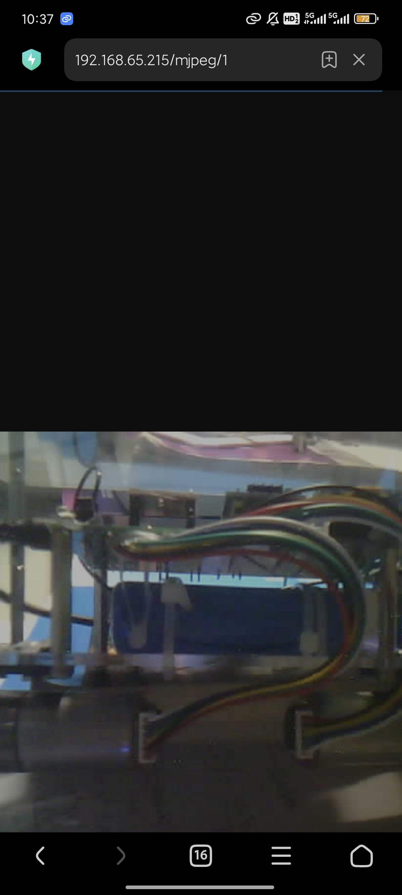

# :star:Robot_balance_car

## :loudspeaker:简介

这是我们参加`北航2025电子创新大赛`制作的项目，我们采用`STM32`作为主控，实现了一款可以在狭小空间内进行空气检测和火灾隐患巡查的平衡车。

*This is a project **participating in the 2025 Electronic Innovation Competition of Beihang University**. We used STM32 as the main control to realize a balancing car that can perform air detection and fire hazard inspection in a small space.*

## :sparkles: 功能特性

* STM32F10C8T6核心板
  
* 两轮平衡小车，手机蓝牙遥控
  
* ESP32CAM+WIFI图传
  
* OLED实时显示温湿度传感、烟雾浓度传感、遇火焰蜂鸣器报警
  
* 按键调节报警阈值
  

## ::效果图

(加入视觉识别模块和舵机控制之后还要修改)



* * *

## :pushpin: 我们制作了详细的复刻教程，并在过程中，留下我们从纯小白到初出茅庐过程中的制作经验、学习一些模块时候的资料和思考。（各模块的手册和示例代码可在“模块”文件夹内找到）

* * *

## 环境配置

Windows端：



* Arduino IDE
  
  * 推荐安装教程： https://www.bilibili.com/video/BV1tWZqYNEwP/?share_source=copy_web&vd_source=8eddcd42dc192592504b28b1d0b0fe27
* Keil uVision5
  
  * 推荐安装教程： https://www.bilibili.com/video/BV1th411z7sn/?p=3&share_source=copy_web&vd_source=8eddcd42dc192592504b28b1d0b0fe27
* 嘉立创EDA(专业版)
  
  * 推荐安装教程： https://www.bilibili.com/video/BV1Q441167nu/?share_source=copy_web&vd_source=8eddcd42dc192592504b28b1d0b0fe27

手机端：



* 蓝牙调试器
  
* 浏览器
  

* * *

## 硬件材料清单(附Excel文件)



* * *

## 平衡小车制作

## 一、焊接主控

按图焊接即可。此处补充笔者初学焊接的经验：

📝 焊接排针的实用技巧

* 🚷 **安全健康:** 焊接产生的烟雾可能会导致头晕等，尽可能在通风良好的环境焊接。有条件的话，使用排风设备。
  
* 🔍 **工具:** 
  
  * 推荐使用恒温烙铁，保持稳定的工作温度，避免虚焊或损坏电路元件。
    
  * 焊接细小元件，可用焊锡膏＋热风枪。
    
* 🔥 **焊接技巧:** 
  
  * 焊接排针时，固定好一个焊点后再焊接其他焊点，避免排针的移动。
    
  * 焊接电线，可以先往电线上加一点锡（不能太多）
    
  * 焊接表面过于光滑，可以弄一点划痕
    
* 🧼 使用湿海绵清洁烙铁头，不然烙铁头上的残渣反复被加热会氧化，影响吸附。
  
* 🕒 **焊接时间:** 每个焊点需要加热约两秒钟，焊锡充分熔化，与焊接部件良好结合，防止虚焊。
  
* 🛠️ **元件的方向:** 焊接时必须特别注意模块的方向，错误接入很可能导致电路损坏，尤其是电源模块，以及编码器电机的编码器，一定一定要看好接线图。
  
* 🚦 **检测焊接质量:** 用万用表测试电路的导通性和电压输出，避免因接错焊点而导致电路异常。
  

* * *

## 二、组装机械结构

平衡小车的机械结构大同小异，B站有不少组装教程。

e.g.[4.小车拼装教程_哔哩哔哩_bilibili](https://www.bilibili.com/video/BV1Gc411v73h?spm_id_from=333.788.videopod.episodes&vd_source=418d43b5808f02eef3f6ab61b59ae8fe&p=4)

注意外露的电线不要触碰在一起，以及有的排针排母、模块等连接不牢固可以用热熔胶枪固定一下。

* * *

## 三、模块代码编写

### 1.OLED

初学者可先学习如何在OLED模块上显示数字、字符串和汉字等内容。OLED模块与传统LCD显示器的主要区别是OLED没有背光，OLED技术的最大优势也在于能够做到完全黑色显示，这是由于其每个像素能独立控制，不需要背光，产生更高的对比度和更深的色彩。相比之下，LCD即使在显示黑色时，背光仍会影响色彩表现。使用I2C通信协议进行设备间的数据传输，底层寄存器操作复杂，推荐使用封装好的驱动代码来提高编写速度。项目中提供了实际操作代码和步骤，供参考和执行。

⚠️ **软件设置的注意事项**：在设置驱动和开发环境时，确保常见引脚设置的正确性（如PA13和PA14用于下载），避免因引脚配置错误而引发的调试问题。

* * *

### 2.MPU6050

MPU6050是一个六轴传感器，能够同时读取三轴加速度和角速度数据。内置有数字运动处理（DMP）模块，可以进行自态解算，得到欧拉角，包括横滚角、俯仰角和偏航角。

在该项目中，我们将实现如何通过STM32与该模块进行通信，将获取的角度数据通过OLED屏幕进行显示，学会有关电路连接、工程文件管理、编写驱动代码，以及使用CubeMX配置I2C接口，最终在OLED上成功显示实时角度值的变化。

#### 📖简要步骤：

1.电路图与硬件连接

电路图显示该模块具有八个引脚，其中主要使用四个引脚。包括电源引脚、D引脚及I2C的两个接口。

2.软件开发环境设置

在打开CubeMX后，选择PB3和PB4作为I2C接口，但有必要说明其是软件模拟I2C，而不是硬件I2C。

3.添加MPU6050库函数

在工程目录中添加MPU6050的驱动代码，包括头文件和C文件。

4.编写主程序

主程序的编写包括初始化MPU6050模块和I2C接口。在初始化成功后，显示信息指示成功与否。同时定义三个角度参数并调用DMP读取函数，每隔十毫秒读取一次数据。为了方便输出，插入了标准输入输出相关代码。

5.显示数据

在OLED显示上需要将读取到的角度值转化为字符串，通过格式化函数使得显示内容保持两位小数。在显示时添加适当的空格，以避免数据重叠或显示不清晰。

6.测试效果

经过编译和下载程序后，按下复位键，成功地在屏幕上看到了动态变化的角度参数。其中翻滚角和俯仰角发生的变化较为明显，偏航角的值也保持稳定，这表明MPU6050与STM32之间的通信和数据处理已成功实现。

* * *

### 3.电机驱动模块

电机驱动主要由STM32单片机、驱动模块和输出电机三个部分构成。驱动模块的作用是将3.3V的单片机信号转换为12V的电机驱动信号。

本项目使用了TB662模块，初学者可了解驱动模块故障的排查方法、PWM信号的应用、电机转向和转速控制的原理、H桥驱动方式。此外，视频还演示了如何通过程序进行电机的速度和方向控制，以及相应的代码实现步骤。

#### 💡经验

1. 组成部分

电机驱动系统主要由三个部分组成：STM32单片机、驱动模块和输出电机。STM32作为控制单元，负责生成控制信号；驱动模块负责将较低电压（3.3V）的控制信号转换为能够驱动电机的高电压（12V）信号；而电机则是最终执行机构。

2. 驱动模块功能

驱动模块的关键功能是电压转换。如果电机只有单向转动或只有一个电机运转，问题通常出在驱动模块。故障排查首先需要检查焊接和连接是否良好。此外，驱动模块一般较为耐用，但在电机堵转或过载时可能产生高电流，从而导致发热，严重时可能损坏电机。TB662驱动模块含有高温保护功能，当温度过高时会自动断电防止损坏。

3. 模块选择及差异

在模块选择上，常见的有红色和黑色板，主要区别在于电容的耐压值。电容的耐压需要比实际工作电压高出1.5倍。例如，16V的耐压值允许的工作电压约为10.6V，对于设计工作电压为10V的模块非常合适。对于黑色模块，其耐压可达到35V，适于更高电压应用。

4. 驱动模块引脚及原理

驱动模块的引脚设有两个组，通常一个组负责控制电机转速`（PWM）`，另一个组则控制转向`（IN1、IN2）`。使用PWM信号可以调节电机的转速，通过改变高电平的占空比实现。

5. 控制原理

电机驱动具有“半桥驱动”设计，左右两组MOS管交替工作，控制电流方向，从而实现转动。所有MOS管按组排列，按相应信号导通，导致电机顺或逆转。

6. 编程实现

在编写程序时，首先要在开发环境中定义输入信号、设置PWM、调整频率和占空比等。定时器的配置会影响PWM的输出频率，通过计算确定预分频值和自动重载寄存器值。通过`Duty`值的调整实现电机的控制，负值表示反转，正值表示正转。

7. 实现与测试

编写完程序后，进行编译并下载至单片机。观察电机转动时的表现，注意测速和正反转。为了使小车能够前进或后退，两个电机需分别设置为不同的转向，此逻辑便于编程实现。

* * *

### 4.编码器测速

#### 电机测速及编码器使用解析

1.霍尔编码器结构

霍尔编码器由磁环和两个对称分布的霍尔传感器组成。霍尔传感器基于霍尔效应工作——当传感器检测到正极的磁场时，输出高电平；检测到负极时，则输出低电平。通过设置磁环上的正负极交替分布，可以产生周期性的脉冲波，这些脉冲波的频率与电机转速成正比。

2.测速原理

测速的核心在于计算霍尔编码器产生的脉冲频率。初学者可以520电机为例，了解其减速比及脉冲输出的计算方法。若电机的减速比为1:30，每当轮胎大轴转动一圈，小轴的磁环则转动30圈。因此计算大轮胎转动一圈时的输出脉冲为330个（11个脉冲乘以30）。

3.编码器波形演示

可通过逻辑分析仪观察霍尔编码器的输出波形。未转动时，输出为高电平，来回旋转电机后则可以观察到矩形波，具体的占空比和其特性将用示波器进行分析。

4.硬件与软件协同

电机控制采用STM32中定时器的编码器模式，具体设置可以让电机的顺逆时针旋转被有效识别。通过对信号频率的判断，程序将能够准确计算电机的转速。

5.代码实现细节

项目代码可重点阅读如何读取编码器的值——定义相应的函数和变量，确保能定时（例如每10毫秒）读取编码器的状态。严谨管理负数和正数的处理也确保了计数的有效性。

* * *

### 5.蓝牙串口通信

在本项目中，我们使用JDY31串口模块在单片机与手机之间进行串口通信。用户可以通过手机发送遥控指令，控制平衡小车的运动，同时接收单片机实时发送的数据如速度、角度和距离等。

#### ⚙️有关介绍

1.模块概述用于实现单片机与手机之间的串口通信的设备。通过该模块，用户可以通过手机发送控制指令来遥控设备（如平衡小车），实现诸如左转、右转、直行和后退等动作。同时，单片机也可以实时发送相关数据，如速度值、角度值和距离值，以便用户进行查看。

2.模块兼容性有多个版本，包括6帧和4帧模式，均兼容性良好。只需连接中间的四根脚即可。此外，市面上还有其他类型的蓝牙模块，例如HC05等，虽然功能上类似，但在价格和主从机的支持上有所不同。JDY68A为从机，只能被其他设备配对，而HC05具备主从一体的功能，能够作为主机和从机使用。

3.蓝牙配对使用模块时，单片机与手机之间的配对过程是关键。手机作为主机发出配对请求，模块接受请求。需要注意的是，JDY68A模块无法主动发起配对。

4.程序设计编程时，需要在CubeMX环境中进行电路图配置，重要的是TX和RX的正确连接，确保串口通信的正常进行。其中单片机TX引脚连接到蓝牙模块的RX引脚，RX引脚连接到TX引脚，实现数据反向传输。此外，在设置中需配置UART设置，包括波特率、数据位和停止位，以确保双方通信参数一致。

5.数据发送与接收在程序中，使用uartTransmit函数进行数据发送。可调用的示例包括发送"hello world"字符串，随后通过手机APP进行连接和调试。在接收数据时，需要定义接收缓冲变量，并在中断服务程序中实现接收操作。每当接收到一个字符，便进入中断并将其存储到指定的缓冲区中。

6.遥控功能实现接收后数据经过处理，可实现对小车的遥控指令识别，例如：0x01表示前进，0x02表示右转等。通过简单的switch语句可以将接收到的控制数据解码，并执行相应的动作。这套机制使手机能有效控制单片机的多个功能，增强了操作的便利性。

* * *

## 四、烧录代码

连接好stlink（以stlink为例，注意要提前安装好驱动，在配置Keil的视频链接中有教学），打开工程文件，上传即可。

* * *

## 五、PID调参



* * *

## 六、手机蓝牙APP配置

参考项目文件中的.docx文件 `“APP配置”` 。

* * *

## 七、ESP32 CAM WIFI图传系统搭建

ESP32是ESP8266的升级版，主要特点包括由单核升级为双核，主频从80MHz提升至240MHz，并新增了蓝牙模块和TF卡扩展支持。这些改进使得ESP32在性能和可玩性上有了质的提升。建议购买硬件时，将烧录器一并购买，以简化后续程序上传的过程。



将下载整理的代码进行必要的修改后，即可上传。具体操作是打开文件夹中的`esp32_camera_mjpeg_multiclient`，启动Arduino IDE，修改WiFi连接信息，即搜索`wifi.begin`，在此处设置WiFi名称与密码，还可根据需求设置刷新帧率（FPS），可将其调整为适合实际需求的值。









代码修改完成后，点击上传按钮，等待编译完成。在上传完成后，点击右上角的串口监视器，同时按下开发板的复位键。开发板将尝试连接WiFi，当连接成功后会输出一个HTTP地址，该地址为视频流链接。



将输出的HTTP地址放入浏览器，即可查看ESP32 Camera的实时画面。



* * *

## 八、舵机

* * *

Last but not least:

## :speech_balloon:对于小白的建议(明明自己也是)：

1. 学习stm32单片机，可以先学一点基本的库函数开发，然后再使用CubeIDE开发，提高效率。
  
2. 可以多刷一刷好玩的开源项目找找思路，整体创新或者改进。
  
3. 可以接触一些网络方面的知识，后期可能会用到内网穿透等手段。
  
4. PID控制方法在现代自动控制系统中占有重要地位，是许多工程领域尤其是电子与自动化专业的基石。了解其原理能够在今后的学习与工作中更有效地应用控制理论。
