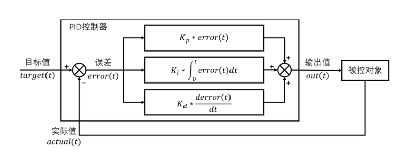
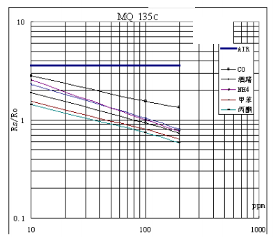
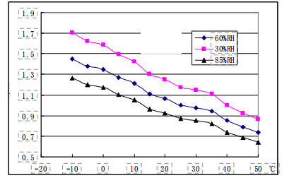
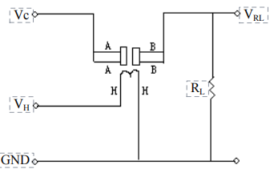
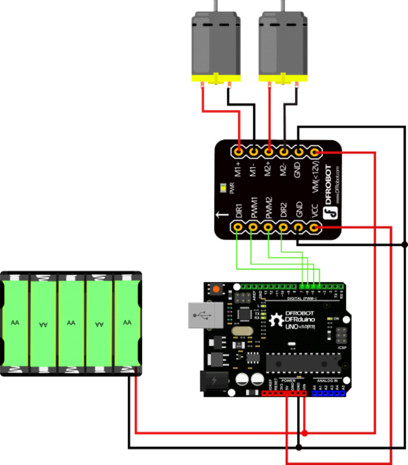

------

# *相关模块*

## pid控制模块——陀螺仪模块mpu6050

### pid控制概述

PID（比例-积分-微分）控制是一种广泛应用于自动控制系统的算法，通过实时调整输出信号来最小化系统误差。在小车应用中，PID控制可用于实现平衡、方向稳定、速度调节等功能。MPU-6000/MPU-6050作为核心传感器，为PID控制提供高精度姿态和运动数据支持。

### MPU-6050在PID控制中的核心作用

#### 多轴传感器数据

**三轴陀螺仪：**测量角速度（±250°/s至±2000°/s），用于检测姿态变化速率。

**三轴加速度计：**测量加速度（±2g至±16g），用于计算倾斜角。

**温度传感器：**补偿环境温度对传感器精度的影响。

#### 数字运动处理器（DMP）

内置DMP硬件加速器，支持传感器数据融合（如9轴融合），直接输出姿态角（俯仰、横滚、偏航），降低主处理器计算负担。

#### 实时数据接口

**I2C/SPI接口：**高速通信（I2C 400kHz，SPI 1MHz），快速传输传感器数据。

**1024字节FIFO：**批量读取数据，减少主控制器频繁中断，优化功耗与实时性。

#### 可编程中断

支持自由落体、运动检测等中断，触发PID控制响应，例如紧急停止或平衡恢复。

### PID控制实现流程

#### 数据采集

通过MPU-6000获取实时姿态角（如俯仰角）、角速度及加速度。

使用DMP输出融合后的欧拉角或四元数，提高数据准确性。

#### 误差计算

比较当前姿态（如俯仰角）与目标姿态（如平衡时的0°），计算误差值。

#### PID算法处理

**比例项（P）：**快速响应误差，但可能引起振荡。

**积分项（I）：**消除稳态误差（如长期倾斜）。

**微分项（D）：**抑制超调，平滑控制输出。

**PID公式与系统框图：**

- **定义误差：$$
  error\left( t \right) =target\left( t \right) -actual\left( t \right) 
  $$​**

- **PID输出值：**
  $$
  out\left( t \right) =K_p\left( error\left( t \right) +\frac{1}{T_i}\int_0^t{error\left( t \right) dt+\frac{T_dderror\left( t \right)}{dt}} \right)
  $$

- **PID输出值：**
  $$
  out\left( t \right) =K_p*error\left( t \right) +K_i*\int_0^t{error\left( t \right) dt+K_d*\frac{derror\left( t \right)}{dt}}
  $$




## 蓝牙模块——JDY-68A蓝牙5.1

### 模块简介

JDY-68A蓝牙5.1模块是一款双模蓝牙模块，支持蓝牙音频（A2DP）和低功耗蓝牙（BLE）透传功能，适用于需要同时处理音频传输与数据通信的场景。

### 双模蓝牙功能

#### **蓝牙音频模式**

- 支持A2DP协议，可通过蓝牙连接播放音乐，音频信号通过模块的**AUDIO引脚（单声道输出）**传输。
- 支持密码配对（默认密码1234），可通过指令（如`AT+PIN`）修改密码。
- 广播名可通过指令（如`AT+NAMA`）自定义，默认名称为`JDY-68A-AUDIO`。

#### **BLE透传模式**

- 基于BLE 5.1协议，兼容BLE 4.0/4.2/5.0，提供低功耗数据传输功能。
- 支持自定义**16位或128位UUID**，用户可通过指令（如`AT+SV16UUID`、`AT+SV128UUID`）修改服务与特征值UUID。
- 默认广播名为`JDY-68A-BLE`，可通过`AT+NAME`指令修改。

### AT指令配置

模块通过**UART串口**发送AT指令进行配置，指令需以`\r\n`结尾（串口工具勾选“发送回车”可自动添加）。常用指令如下：

#### 基础配置

- `AT+BAUD`：设置波特率（默认9600，修改后需重启生效）。
- `AT+RESET`：软复位模块。
- `AT+STAT`：查询连接状态。
- `AT+DISC`：主动断开蓝牙连接。

#### UUID与广播名

- `AT+NAME`：设置BLE广播名。
- `AT+SV16UUID`：修改16位服务UUID（默认`FFE0`）。
- `AT+DA128UUID`：修改128位透传特征UUID（默认`0000FF11...`）。

#### 音频控制

- `AT+VOLUME`：调节音量（0-18级）。
- `AT+NEXT/AT+LAST`：切换上下曲目。
- `AT+PPLAY`：播放/暂停。

#### 扩展功能

- `AT+GPIOEN1`：启用STAT和ALED作为GPIO3/GPIO4输出引脚。
- `AT+STTIO1`：配置STAT引脚为音频连接状态指示。


## 烟雾传感器——MQ135

### 模块简介

MQ135是一款广泛应用于空气污染检测的气体传感器，能够高效检测氨气、硫化物、苯系蒸汽等多种有害气体。

### 核心特点

- **宽浓度检测范围**：支持10-1000ppm的气体浓度检测。
- **高灵敏度**：对氨气、硫化物、苯系气体等响应显著。
- **低成本与长寿命**：适合长期监测场景。
- **简单驱动电路**：仅需加热电压和负载电阻即可工作。

### 核心功能原理

#### 气敏材料特性

- **电导率变化机制**：在清洁空气中，SnO₂电导率较低；当存在目标气体时，气体分子与SnO₂表面发生反应，导致电导率随气体浓度升高而增大。
- **信号转换**：通过串联负载电阻（RL）将电导率变化转换为电压信号（VRL），便于后续电路处理。

#### 灵敏度特性

- **电阻比（Rs/Ro）**

  - **Rs**：传感器在目标气体中的电阻值。
  - **Ro**：传感器在100ppm氨气中的基准电阻值。

- **典型曲线**

  - 灵敏度随气体浓度呈非线性变化。

    

  - 温湿度影响显著，需在标准条件（20℃/65%RH）下校准。

    

### 测试电路与使用方法

#### **基本测试电路**

- **电路组成**

  

  - **加热回路**：提供5V加热电压（VH），确保传感器工作温度。
  - **检测回路**：串联负载电阻（RL），测量VRL以计算传感器电阻（Rs）。

- **电阻计算公式**： 
  $$
  R_S=\left( \frac{V_C}{V_{RL}}-1 \right) \times R_L
  $$

*校准与调试**

- **预热要求**：首次使用需通电48小时以上以稳定性能。
- **温湿度补偿**：需在标准环境（20℃/65%RH）下校准，或通过算法修正温湿度影响。

## 温湿度传感器——DHT11

### 模块简介

DHT11是一款集成数字信号输出的温湿度复合传感器，采用电容式感湿元件和NTC测温技术，具有高精度、低成本、快速响应等特点。

### 主要特性

- **复合测量：**同时输出温度（-20℃ ~ 60℃）和湿度（5% ~ 95%RH）。
- **数字信号输出：**单总线通信协议，简化外围电路设计。
- **校准功能：**出厂预校准，无需额外标定。
- **低功耗：**待机电流0.06mA，测量时电流≤1mA。

### 核心功能原理

#### **感湿原理**

- **电容式感湿元件**：湿度变化引起感湿材料介电常数变化，转换为电容值变化，再通过电路处理输出数字信号。
- **NTC测温**：温度变化导致热敏电阻阻值变化，经ADC转换为数字信号。

#### **单总线通信**

- **数据格式**：40位数据包（8位湿度整数+8位湿度小数+8位温度整数+8位温度小数+8位校验和）。
- **校验机制**：校验位=湿度整数+湿度小数+温度整数+温度小数，确保数据准确性。
- **通信时序**：主机发送起始信号（拉低≥18ms）→传感器响应（83μs低电平+87μs高电平）→逐位传输数据。

#### **温度表示**

- **正温度**：温度低8位最高位为0（如24.4℃表示为0001100000000100）。
- **负温度**：温度低8位最高位为1（如-10.1℃表示为0000101010000001）。

### 通信协议与数据解析

#### **通信流程**

- **步骤1**：主机拉低DATA线≥18ms，发送起始信号。
- **步骤2**：传感器响应83μs低电平+87μs高电平。
- **步骤3**：传输40位数据（高位优先），每bit以54μs低电平起始，后接高电平时长区分“0”（23-27μs）和“1”（68-74μs）。

#### **数据示例**

- **接收数据**：`00110101 00000000 00011000 00000100 01010001`
  - **湿度**：53%RH（整数）+0.0%RH（小数）=53.0%RH
  - **温度**：24℃（整数）+0.4℃（小数）=24.4℃
  - **校验位**：53+0+24+0.4=77.4 → 末8位为77（0x4D），与校验位匹配则数据有效。

### 典型应用电路

#### **接线图**

- **核心电路：**VDD接5V，DATA接MCU I/O口并上拉4.7kΩ电阻，GND接地。
- **长线补偿：**连接线＞5m时，降低上拉电阻阻值以增强信号稳定性。


#### 注意事项

- **电源干扰**：避免开关电源纹波过大，建议增加滤波电容。

- **环境限制**：长期暴露于盐雾、酸性气体会降低传感器寿命

  

## STM32最小系统板

### 模块简介

STM32F103C8T6最小系统板集成高性能32位处理器，支持72MHz主频，内置64KB闪存与20KB SRAM，提供多种通信接口（UART、SPI、I2C、USB、CAN等），具备低功耗模式与高精度外设。

### 核心功能原理

#### **ARM Cortex-M3内核**

- 最高72MHz工作频率，1.25DMIPS/MHz性能，支持单周期乘法和硬件除法。
- 内置嵌套向量中断控制器（NVIC），支持多优先级中断管理，响应延迟低至6个时钟周期。

#### **时钟系统**

- **外部时钟**：支持4-16MHz晶体振荡器（HSE）与32.768kHz低速晶振（LSE）。
- **内部时钟**：8MHz高速RC振荡器（HSI）与40kHz低速RC振荡器（LSI），支持PLL倍频至72MHz。

#### **电源管理**

- **供电范围**：2.0V-3.6V宽电压输入，内置电压调节器支持低功耗模式（睡眠、停机、待机）。
- **VBAT引脚**：支持外部电池供电，维持RTC与备份寄存器数据。

#### **复位与启动**

- 支持上电复位（POR）、掉电复位（PDR）与手动复位（NRST引脚）。
- **启动模式**：通过BOOT0/BOOT1引脚选择从Flash、系统存储器或SRAM启动。

#### **调试接口**

- **SWD/JTAG**：支持串行单线调试（SWD）与标准JTAG接口，适配ST-Link、J-Link等工具。

### 典型应用电路

#### 核心电路

- **电源滤波**：VDD与GND间并联0.1μF与10μF电容，确保电源稳定性。
- **外部晶振**：8MHz HSE与32.768kHz LSE晶振，匹配电容建议10-22pF。
- **复位电路**：10kΩ上拉电阻与0.1μF电容组成RC复位电路。

#### 扩展接口

- **GPIO排针**：所有I/O口引出至2.54mm间距排针，支持外接传感器与模块。
- **USB接口**：Micro USB连接器，支持供电与数据传输。


## 直流电机驱动模块——TB6612FNG

### 模块简介

TB6612FNG是一款双路全桥直流电机驱动芯片，适用于微型直流电机的控制，支持PWM调速与方向控制，具有高效率、低功耗与高集成度等特点。其基于**双H桥电路**设计，可独立控制两路直流电机的转向与转速，支持3.3 ~ 5V逻辑电压与2.5 ~ 12V电机驱动电压，单通道最大连续电流1.2A（峰值3.2A）。模块通过**DIR（方向控制）**与**PWM（脉宽调制）**信号实现电机的正反转与调速，兼容Arduino等微控制器，适用于机器人、智能小车等场景。

### 核心功能原理

#### **H桥驱动原理**

- **全桥结构**：每路电机由4个MOS管组成H桥，通过切换MOS管的导通状态，控制电流方向，实现电机的正反转。
- 方向控制：DIR引脚电平决定电流流向：
  - `DIR=HIGH` → 电机正转
  - `DIR=LOW` → 电机反转
- **PWM调速**：通过调节PWM信号的占空比（0-255），改变电机平均电压，实现转速控制。

#### **保护机制**

- **过热保护**：内置温度传感器，芯片温度超过阈值时自动关断输出。
- **短路保护**：检测到输出短路时，自动切断电流，防止芯片损坏。

#### **低功耗设计**

- **待机模式**：STBY引脚置低时，模块进入待机状态，功耗降至微安级。

### 典型应用电路

#### 基本接线图

- **电机连接**：M1+、M1-接电机1；M2+、M2-接电机2。
- **控制信号**：DIR1/PWM1接MCU的GPIO与PWM输出引脚。
- **电源隔离**：逻辑电源（VCC）与驱动电源（VM）需独立供电，避免干扰。



#### 保护电路设计

- **滤波电容**：在VM与GND间并联100μF电解电容，抑制电压波动。
- **续流二极管**：电机两端并联二极管，防止反向电动势损坏芯片。

### 控制逻辑与代码示例

#### **方向与调速控制**

- **正转**：DIR置高，PWM占空比越大转速越高。
- **反转**：DIR置低，PWM占空比调节反向转速。

#### **Arduino代码示例**

```
int DIR1 = 4;  // 方向控制引脚
int PWM1 = 5;  // 调速引脚（需支持PWM输出）

void setup() {
  pinMode(DIR1, OUTPUT);
  pinMode(PWM1, OUTPUT);
}

void loop() {
  digitalWrite(DIR1, HIGH);  // 正转
  analogWrite(PWM1, 200);     // 中速运行（占空比200/255）
  delay(2000);
  
  digitalWrite(DIR1, LOW);   // 反转
  analogWrite(PWM1, 100);     // 低速运行
  delay(2000);
}
```

​	

